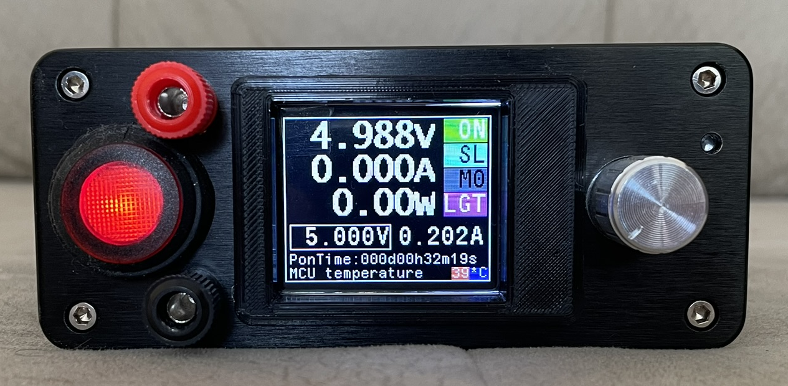

[БГ] PSU_F030CCT6 е програма от тип фърмуер която след записването си в
контролер модел STM32F030CCT6 запоен върху печатна платка ISTM32PSU-F030-B
изпълнява основните функции по управлението на линейното захранване.
Управлението се извършва посредством механичен енкодер, а визуализацията на
състоянието се осъществява посредством течнокристален дисплей с размер на
диагонала 1,77”. Подробна информация за самото захранване, програмата за
управлението му и детайли как да изработите силовата, управляващата и
комуникационната платки ще намерите на https://www.stm32dds.tk/stm32-psu
Съгласно приложената снимка със най-големият шрифт са текущите стойности на
напрежението, тока и мощността върху товара (ако такъв е включен).
Кратковременно натискане на енкодера превключва към следващото меню. Текущо
избраното меню е оградено в бял правоъгълник (в случая на снимката  -
заданието за напрежение). Въртенето на енкодера увеличава, намалява стойност
или променя функционалност на устройството. Продължителното задържане на
енкодера натиснат в зависимост от избраното меню има различно въздействие.
Следва описание на менютата и съответните опции които които са налични чрез тях:
1.При първоначално стартиране активно е менюто за задаване на напрежение,
  въртенето на енкодера увеличава или намалява заданието, продължителното
  задържане на енкодера натиснат (>0.5s) включва или издлючва силовият изход.
  С кратко натискане преминаваме в следващото меню 
2.Меню “ограничение на максималният ток” - въртенето на енкодера променя тази
  стойност, задържането му включва или изключва силовият изход. 
3.Меню ON/OFF - завъртане по часовниковата стрелка включва силовият изход,
  против часовниковата стрелка го изключва. Продължителното задържане в
  натиснато положение в зависимост от състоянието на силовият изход (включен
  или изключен) дава следните възможности, при включен изход избор между
  стандартен режим на регулировка или автоматична донастройка на напрежението,
  а при изключен силов изход е възможен и избор на донастройка по ток.
  При избран режим на донастройка това се индикира с промяна в цвета на
  съответната измервателна единица на екрана. 
4.Меню MS/SL - при изграждане на мрежа от устройства или управлението му през 
  компютър се избира управляващ или управляван режим на работа. Когато
  устройството е самостоятелно режимът по подразбиране е SL. Продължителното 
  задържане на вграденият в енкодера бутон включва, изключва силовият изход. 
5.Меню М0-М9 - десет позиции памет за напрежение в изхода и токоограничение.
  При изключен силов изход със задържане избирате съответната клетка памет, при
  включен силов изход запаметявате в избраната с въртене на енкодера клетка. 
6.Меню LGT/MAX - въртенето регулира осветеността на екрана, продължителното
  задържане включва или изключва силовият изход 

[EN] PSU_F030CCT6 is a firmware program that, after being written in a
controller model STM32F030CCT6 soldered on a printed circuit board
ISTM32PSU-F030-B, performs the main functions of controlling the linear power
supply. The control is carried out by means of a mechanical encoder, and the
visualization of the status is carried out by means of a liquid crystal display
with a diagonal size of 1.77". Detailed information about the power supply
itself, the program for its control and details on how to make the power,
control and communication boards can be found at
https://www.stm32dds.tk/stm32-psu According to the attached photo, the largest
font is the current values of voltage, current and power on the load (if is
under load). A short press on the encoder switches to the next menu. The
currently selected menu is enclosed in a white rectangle (in the case of the
photo - the voltage assignment). Rotating the encoder increases, decreases a
value, or changes the functionality of the device. Holding the encoder pressed
for a long time, depending on the selected menu, has a different impact.
The following is a description of the menus and the corresponding options that
are available through them: 
1.At initial start-up, the voltage setting menu is active, the rotation of the
  encoder increases or decreases the set, the long holding of the encoder is
  pressed (>0.5s) turns on or off the power output. With a short press we go to
  the next menu 
2.Menu "maximum current limit" - the rotation of the encoder changes this value,
  holding it turns on or off the power output. 
3.ON/OFF menu - turn clockwise turns on the power output, counterclockwise
  turns it off. Prolonged holding in the pressed position depending on the
  state of the power output (on or off) gives the following options, when the
  output is turned on, a choice between standard mode of regulation or
  automatic to voltage setting, and when the power output is turned off, it is
  also possible to choose to auto adjust the current. When some of “auto”
  setting mode is selected, this is indicated by a change in the color of the
  corresponding unit of measurement on the screen. 
4.MS/SL menu - when building a network of devices or managing it through a
  computer, a control or controlled mode of operation is selected. When the
  device is on its own, the default mode is SL. Holding the encoder's built-in
  button for a long time turns the power output on, off. 
5.Menu M0-M9 - ten positions memory for output voltage and current limit. When
  the power output is switched off with a hold, select the corresponding memory
  cell, with the power output turned on, save it to the cell selected
  by rotating the encoder.
6.LGT/MAX menu - rotation adjusts the illumination of the screen, long hold
  turns the power output on or off
  
  